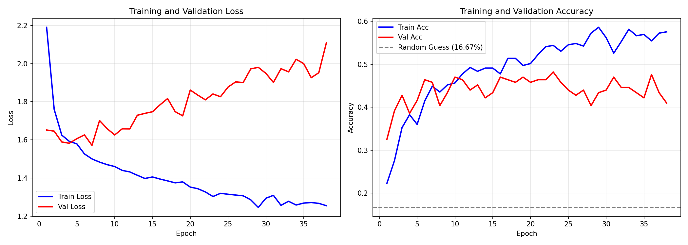
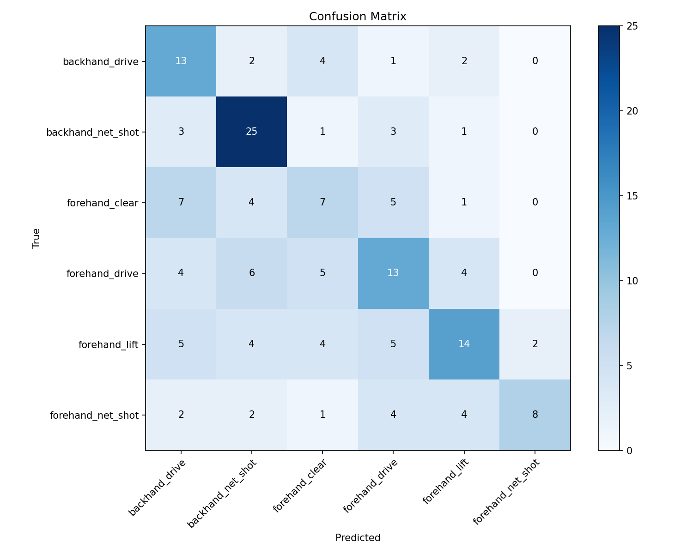

# 羽毛球击球动作识别系统

基于 MediaPipe Pose 与骨架序列 Transformer 的羽毛球击球动作识别

## 📋 项目简介

本项目实现了一个基于人体骨架序列的羽毛球击球动作识别系统。系统使用 MediaPipe Pose 从视频中提取人体33个关键点的时空轨迹，通过 Transformer Encoder 学习骨架序列的动态特征，完成6类羽毛球击球动作的分类任务。

## 📊 数据集

使用 Kaggle 羽毛球击球视频数据集，包含6个类别共830个视频样本：

| 类别ID | 英文名称 | 中文说明 | 样本数 |
|--------|----------|----------|--------|
| 0 | backhand_drive | 反手平抽 | 110 |
| 1 | backhand_net_shot | 反手网前球 | 167 |
| 2 | forehand_clear | 正手高远球 | 118 |
| 3 | forehand_drive | 正手平抽 | 158 |
| 4 | forehand_lift | 正手挑球 | 173 |
| 5 | forehand_net_shot | 正手网前球 | 104 |

数据集来源：[Kaggle - Badminton Stroke Video](https://www.kaggle.com/datasets/shenhuichang/badminton-storke-video)

## 🏗️ 项目结构

```
作业15/
├── badminton_stroke_video/          # 原始视频数据集
│   ├── backhand_drive/
│   ├── backhand_net_shot/
│   ├── forehand_clear/
│   ├── forehand_drive/
│   ├── forehand_lift/
│   └── forehand_net_shot/
├── processed_data/                  # 处理后的骨架数据
│   ├── X_train.npy                  # 训练集特征 (664, 30, 132)
│   ├── y_train.npy                  # 训练集标签
│   ├── X_test.npy                   # 测试集特征 (166, 30, 132)
│   ├── y_test.npy                   # 测试集标签
│   ├── label_map.json               # 类别映射
│   ├── best_model.pth               # 最佳模型权重
│   ├── training_curves.png          # 训练曲线图
│   ├── confusion_matrix.png         # 混淆矩阵图
│   └── training_config.json         # 训练配置
├── src/
│   ├── preprocess.py                # 数据预处理脚本
│   ├── train.py                     # 模型训练脚本
│   └── inference.py                 # 测试与推理脚本
├── README.md                        # 项目说明文档
└── 实验报告.md                       # 详细实验报告
```

## 🔧 使用说明

### 1. 数据预处理

将原始视频转换为骨架序列数据：

```bash
cd /path/to/project
python src/preprocess.py
```

**预处理流程**：
- 使用 MediaPipe Pose 提取33个人体关键点
- 每个关键点包含 x, y, z, visibility 四个特征
- 每帧特征维度：33 × 4 = 132维
- 统一重采样为30帧
- 归一化：以髋部为中心，肩宽为尺度
- 划分训练集和测试集（8:2比例）

### 2. 模型训练

训练 Transformer 分类模型：

```bash
python src/train.py
```

**训练配置**：
- 模型：4层 Transformer Encoder
- 隐藏维度：256
- 注意力头数：8
- 优化器：AdamW (lr=1e-4)
- 损失函数：CrossEntropyLoss + Label Smoothing
- 早停机制：15轮无提升则停止

### 3. 测试与推理

```bash
# 测试集评估 + 单视频推理
python src/inference.py

# 批量推理（修改代码中的视频路径）
```

## 📈 实验结果

### 模型性能

| 指标 | 值 |
|------|-----|
| 测试准确率 | 48.19% |
| 最佳验证准确率 | 48.19% |
| 模型参数量 | 2.18M |

### 各类别性能

| 类别 | Precision | Recall | F1-score |
|------|-----------|--------|----------|
| backhand_drive | 0.38 | 0.59 | 0.46 |
| backhand_net_shot | 0.58 | 0.76 | 0.66 |
| forehand_clear | 0.32 | 0.29 | 0.30 |
| forehand_drive | 0.42 | 0.41 | 0.41 |
| forehand_lift | 0.54 | 0.41 | 0.47 |
| forehand_net_shot | 0.80 | 0.38 | 0.52 |

### 训练曲线



### 混淆矩阵



## 🧠 模型架构

```
输入: [B, 30, 132]
    ↓
Linear Embedding: 132 → 256
    ↓
LayerNorm + Dropout(0.3)
    ↓
Learnable Positional Encoding
    ↓
Transformer Encoder × 4层
├── Multi-Head Self-Attention (8 heads)
├── Feed-Forward Network (512维)
├── GELU激活函数
├── Dropout(0.3)
└── Pre-Norm结构
    ↓
Global Average Pooling
    ↓
MLP分类头: 256 → 128 → 6
    ↓
输出: 6个类别的logits
```

## 📝 代码说明

### preprocess.py - 数据预处理

```python
# 核心功能
- extract_pose_from_video(): 提取视频骨架序列
- normalize_pose(): 归一化骨架坐标
- process_dataset(): 批量处理数据集
```

### train.py - 模型训练

```python
# 核心功能
- SkeletonTransformer: Transformer分类模型
- train_epoch(): 单轮训练
- evaluate(): 模型评估
- 早停机制和模型保存
```

### inference.py - 测试推理

```python
# 核心功能
- evaluate_test_set(): 测试集评估
- inference_single_video(): 单视频推理
- inference_batch(): 批量视频推理
```

## 🔬 技术细节

### 骨架关键点索引

MediaPipe Pose 33个关键点坐标：

| 索引 | 关键点 | 索引 | 关键点 |
|------|--------|------|--------|
| 0 | nose | 11 | left_shoulder |
| 1 | left_eye_inner | 12 | right_shoulder |
| 2 | left_eye | 13 | left_elbow |
| 3 | left_eye_outer | 14 | right_elbow |
| 4 | right_eye_inner | 15 | left_wrist |
| 5 | right_eye | 16 | right_wrist |
| ... | ... | 23 | left_hip |
| ... | ... | 24 | right_hip |

### 归一化方法

1. **平移归一化**：以左右髋部中心为原点
2. **尺度归一化**：以肩宽为缩放尺度

```python
hip_center = (left_hip + right_hip) / 2
shoulder_width = distance(left_shoulder, right_shoulder)
x = (x - hip_center.x) / shoulder_width
y = (y - hip_center.y) / shoulder_width
```

## 📊 性能分析

### 优点
- ✅ 计算效率高：骨架序列大幅降低计算量
- ✅ 可解释性强：可可视化人体运动轨迹
- ✅ 泛化能力好：不依赖场景背景

### 局限性
- ⚠️ 依赖人体检测准确性，遮挡时性能下降
- ⚠️ 对于高度相似的动作区分能力有限
- ⚠️ 需要足够训练样本

## 🚧 改进方向

1. **数据层面**
   - 增加数据增强（时间扭曲、关键点抖动）
   - 少数类别过采样
   - 收集更多反手类别样本

2. **模型层面**
   - 使用更大规模预训练模型
   - 引入时序卷积层
   - 添加注意力可视化

3. **特征层面**
   - 计算关键点间相对距离和角度
   - 提取运动速度和加速度特征
   - 两阶段分类（正手/反手 → 细分类别）
